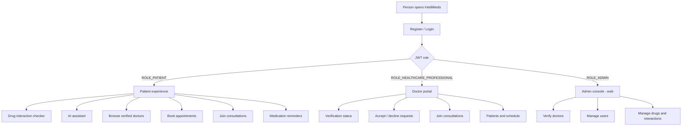
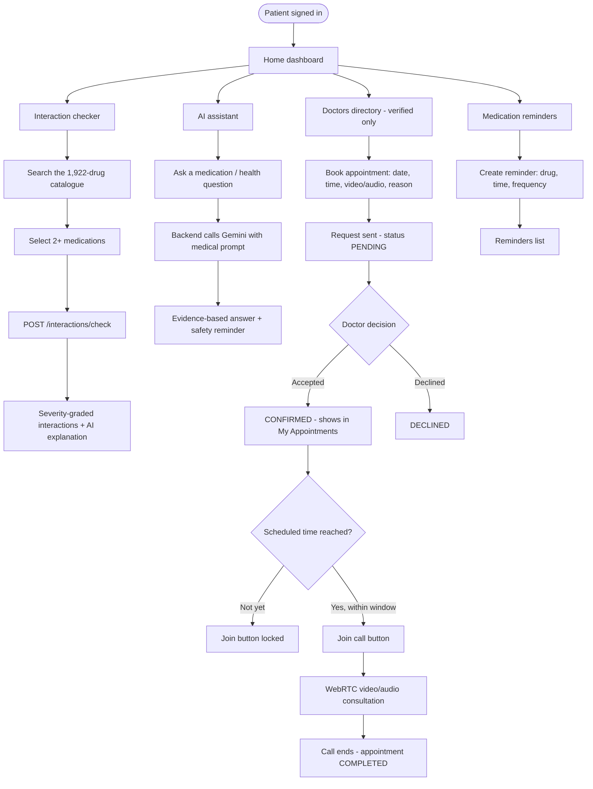
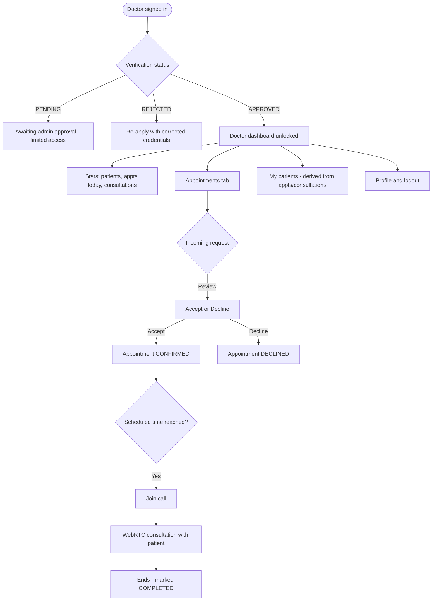
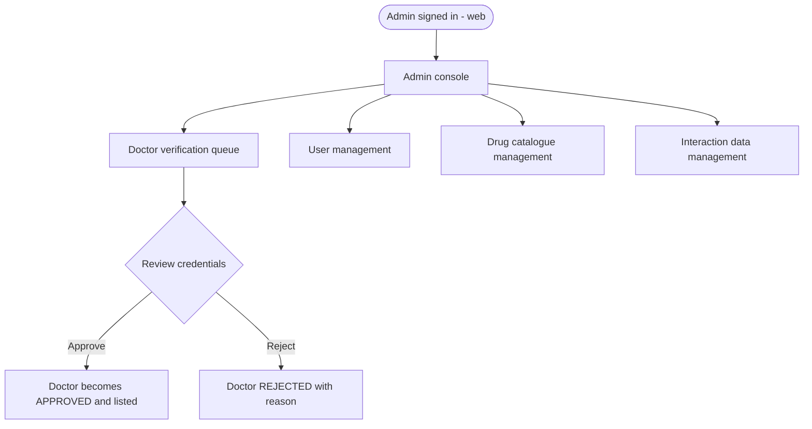
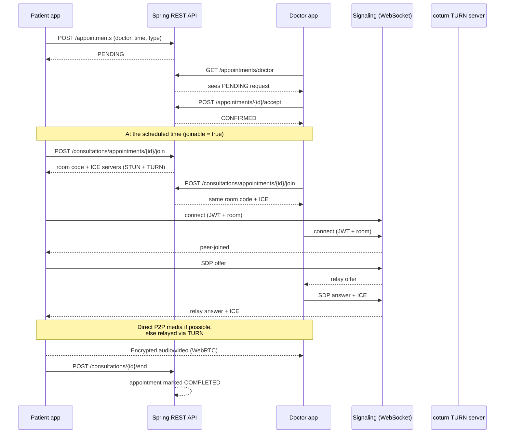
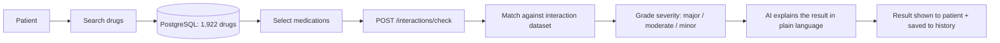
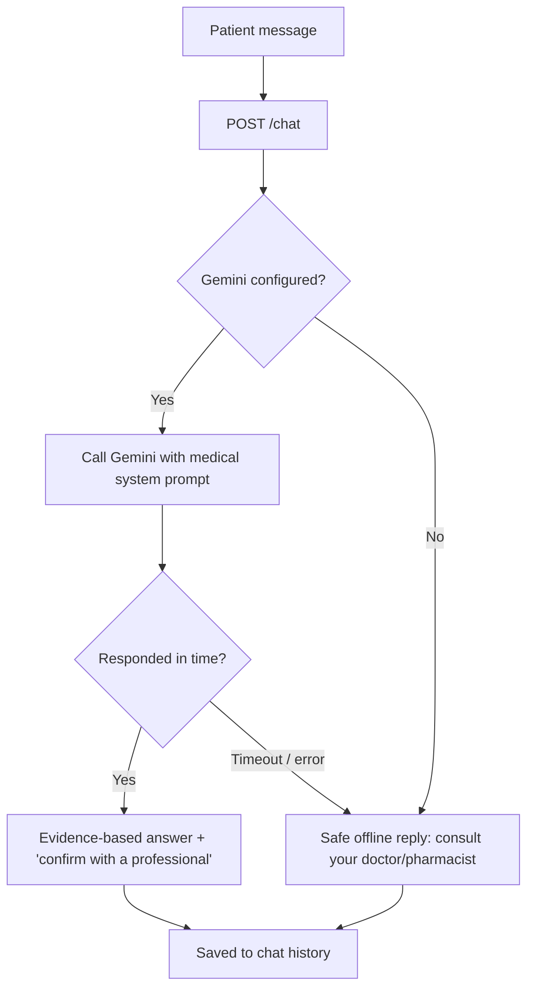
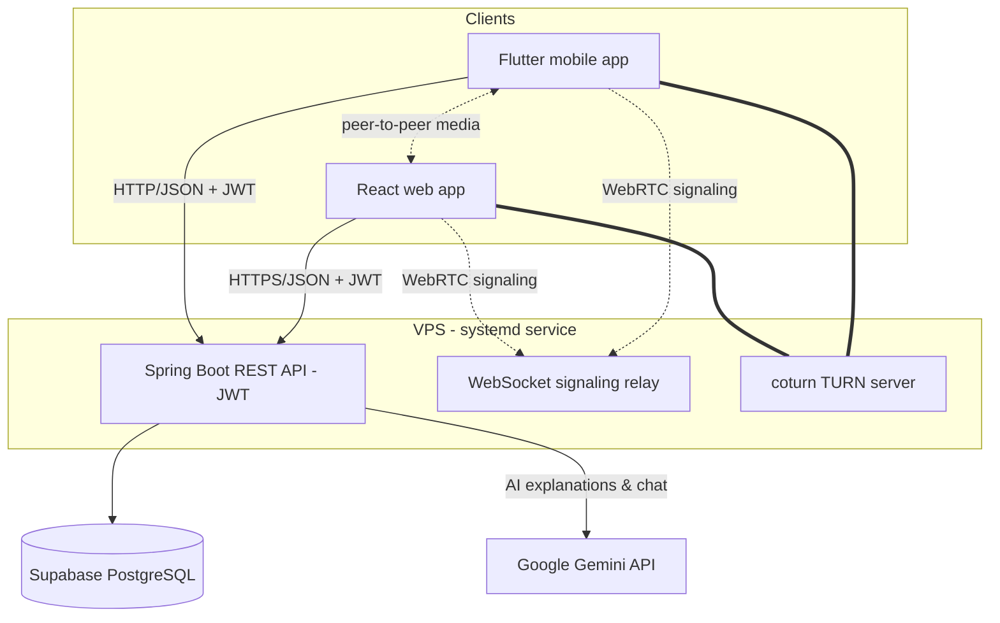

# IntelliMeds — Novelty, Significance & System Flows

> A medication-safety and tele-health platform that unifies **drug-interaction
> checking**, an **AI medical assistant**, and **doctor–patient video/audio
> consultations** behind one role-aware account system — delivered across a
> Spring Boot API, a React web app, and a Flutter mobile app.

---

## 1. Why this project is novel

Most health apps do *one* of these things. IntelliMeds is unusual in stitching the
**full safety-to-care loop** into a single, coherent product:

| Capability | What makes it notable here |
|---|---|
| **Real drug-interaction checker** | Backed by a live catalogue of **1,922 real drugs** in PostgreSQL and a real interaction dataset — not a toy list. Results are graded by severity and **explained in plain language by AI**. |
| **AI medical assistant** | A Google **Gemini**-powered chatbot constrained by a shared **medical-safety system prompt** (evidence-based, defers to professionals, refuses off-topic requests) with a safe offline fallback when the model is unreachable. |
| **Real-time tele-consultation** | Peer-to-peer **WebRTC** video/audio with the server acting only as a **WebSocket signaling relay** — plus a self-hosted **coturn TURN server** so calls connect through strict/mobile NAT. Media never touches the server. |
| **Booking-gated consultations** | Calls can't be started ad-hoc. A patient **books a slot**, the doctor **accepts/declines**, and the call only opens **at the scheduled time** — mirroring how real clinics work. |
| **Trust & verification** | Doctors are a distinct role with an **admin-reviewed verification** workflow; only verified doctors appear to patients and can consult. |
| **Three real surfaces, one backend** | The same stateless **JWT** API serves a **React** web app and a **Flutter** mobile app, with **role-based routing** giving patients, doctors, and admins different experiences. |

**In one line:** IntelliMeds turns "is this medication safe for me?" and "I need to talk
to a doctor" into a single guided journey — check interactions, ask the AI, book a
verified doctor, and meet them over a real video call — all governed by one identity system.

### Engineering notes worth highlighting
- **Privacy-preserving media**: WebRTC keeps audio/video peer-to-peer; the backend only
  brokers SDP/ICE. TURN relays media only when a direct path is impossible.
- **Timezone-correct scheduling**: appointment times are stored in UTC and converted to
  each device's local time, so the join window is correct for users in any region.
- **Resilient by design**: persistent login that survives offline restarts, an AI request
  timeout with graceful degradation, and a bundled drug catalogue fallback when the API is
  unreachable.
- **Production deployment**: runs as a managed **systemd** service on a VPS against a
  Supabase-hosted PostgreSQL database.

---

## 2. The three user types

*Role is read from `/auth/me` after login; the mobile app routes healthcare
professionals to the doctor portal and everyone else to the patient app. The admin
console lives on the web surface.*

---

## 3. Patient journey

---

## 4. Doctor journey

*Only verified doctors are listed in the patient-facing directory and may consult.
A doctor can accept/decline only their own appointment requests (owner-enforced).*

---

## 5. Admin journey

*The seed admin is provisioned on startup from configuration. Admin tooling is on the
web surface; the mobile app intentionally has no admin mode.*

---

## 6. Appointment → consultation (end-to-end sequence)

This is the core interaction that ties patients and doctors together. Media is
peer-to-peer; the backend only relays signaling.

---

## 7. Drug interaction check (data flow)

---

## 8. AI assistant (request flow)

*The app applies its own request timeout and shows a clear message rather than hanging,
so a slow model never looks like a broken feature.*

---

## 9. System architecture

---

## 10. At a glance

- **Users:** Patient · Verified Doctor · Admin — one JWT identity, three experiences.
- **Safety:** 1,922-drug interaction checker with AI-explained, severity-graded results.
- **Guidance:** Gemini medical assistant with safety guardrails and offline fallback.
- **Care:** book → doctor accepts → join a real WebRTC video/audio call at the scheduled time.
- **Trust:** admin-verified doctors; only verified doctors are bookable.
- **Reach:** React web + Flutter mobile on a shared, production-deployed backend.

*The result is a single app that carries a person from a medication question all the way to
a live consultation with a verified doctor — safely, and without ever exposing their call
media to the server.*
